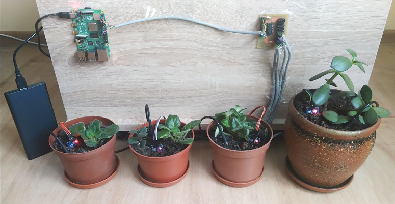
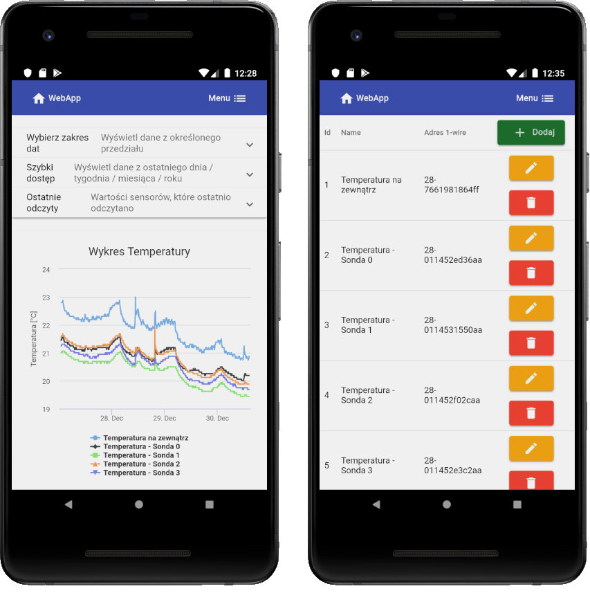
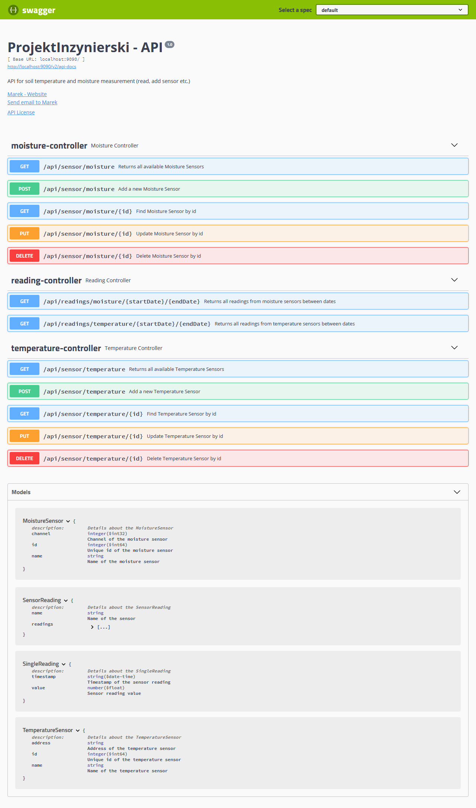

# ProjektInzynierski - Backend App in Java, Spring
### (REST API to communication between DataBase <-> Frontend App)

### PROJECT: measurement soil temperature and moisture on Rasppery Pi) 
 
 
***
## Table of contents
* [General info](#general-info)
* [Technologies](#technologies)
* [Configuration](#configuration)
* [Build a JAR File using Maven](#build-a-jar-file-using-maven)

## General info
The project was created as part of the engineering thesis.
This project is used for implementing communication between the database and the frontend application in Angular. The database stores a list of sensors (soil temperature and moisture) and readings from these sensors. This is a typical REST API using Spring. If you want to know what endpoints this API provides, please see my documentation provided by the application using swagger. Just after running the application, go to this address: http://localhost:9090/swagger-ui.html
 

## Technologies
Project is created in Maven with:
* Java, version: 1.8
* Spring Framework, version: 2.1.8
* Lombok, version: 1.16.16
* Swagger, version: 2.9.2
* Mockito, version: 1.10.19

## Configuration
Before you start working, the program must be configured in application.proporties that is located in: "/src/main/resources/".
```
$ spring.datasource.url=jdbc:mysql://localhost:3306/projekt_inzynierski
$ spring.datasource.username=username
$ spring.datasource.password=password
```
Put here your: database address, database login and password

## Build a JAR File using Maven
If you want to build an application for the * .jar file, you must add the following dependencies to pom.xml:
```
<repositories>
	<repository>
		<id>projectlombok.org</id>
		<url>https://projectlombok.org/edge-releases</url>
	</repository>
</repositories>
```
```
<dependencies>
	<dependency>
		<groupId>org.projectlombok</groupId>
		<artifactId>lombok</artifactId>
		<version>edge-SNAPSHOT</version>
		<scope>provided</scope>
	</dependency>
</dependencies>
```
Now in the project you can execute the command:
```
mvn clean package
```
The JAR file should be located in the folder named 'target'.


